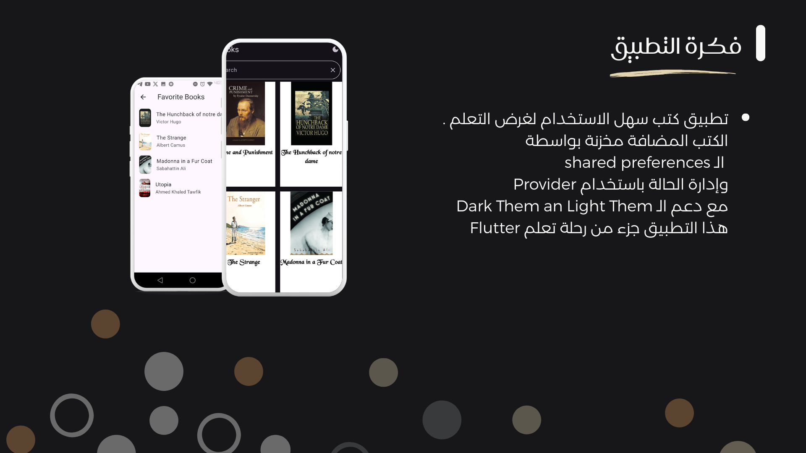

# 📚 Book List App

A simple Flutter app built for learning and practice. The app allows users to browse a list of books, view descriptions, and mark books as favorites. It also supports saving preferences locally and switching between dark and light themes.

---

## 🚀 Features
- 📖 Display a list of books with titles and descriptions.  
- ⭐ Mark/unmark books as favorites.  
- 💾 Save favorite status using **SharedPreferences**.  
- 🎨 Light and Dark theme support.  
- 🔄 State management with **Provider**.  
- 📱 Clean and simple UI for practice.

---

## 🛠️ Tech Stack
- **Flutter** & **Dart**  
- **Provider** – for state management  
- **SharedPreferences** – for local storage  
- **Material Design** – for UI and themes  

---

## 📂 Project Structure
lib/
├── main.dart
├── models/ # (Book model,Books,providers/ # State management)
├── screens/ # App screens (Home, Details,Favorites)
├── shared/__componentes/ # Reusable widgets

--------

## 📖 How It Works
1. The app loads a predefined list of books (title + description,authors).  
2. Users can mark books as "favorite".  
3. The favorite state is stored locally with **SharedPreferences**, so it persists even after restarting the app.  
4. Theme (dark/light) is handled using Flutter’s `ThemeData`.  

---

## 📸 Screenshots

---

## 🎯 Purpose
This project was built as part of my Flutter learning journey, focusing on:  
- State management using **Provider**.  
- Local persistence with **SharedPreferences**.  
- Practicing theming and UI consistency.  

---

## 📬 Contact
If you’d like to connect:  
- GitHub: [Sonialr7iny](https://github.com/Sonialr7iny)  
- LinkedIn: [Soniaalra7ini](www.linkedin.com/in/sonia-alr7ini-663832325)  
